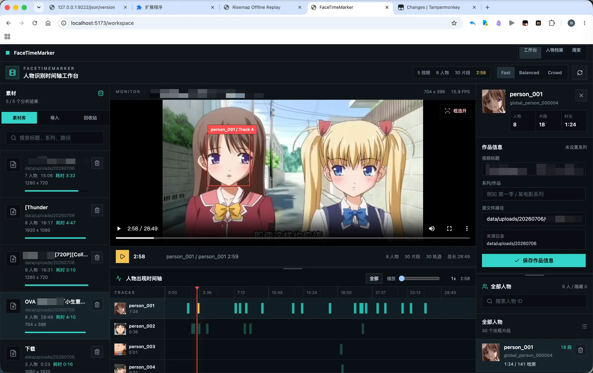
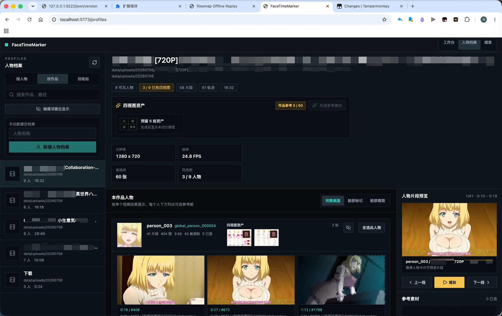
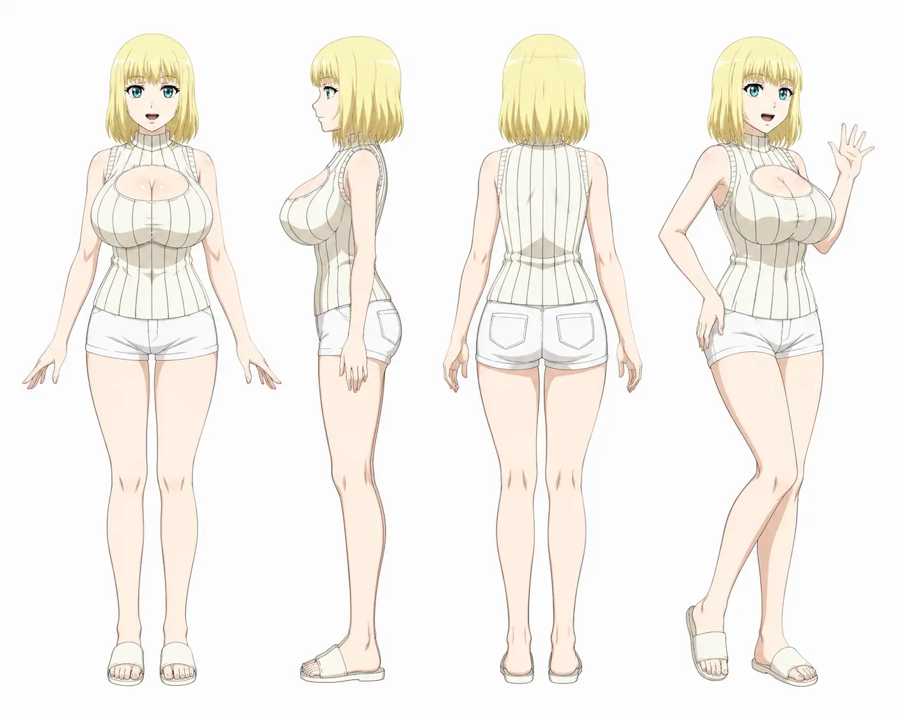
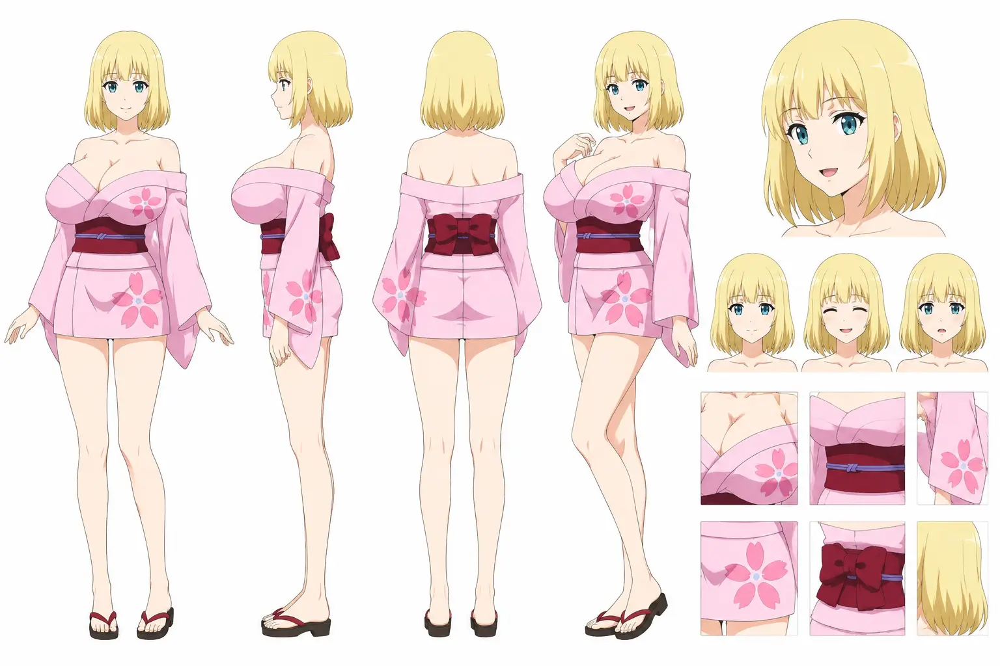
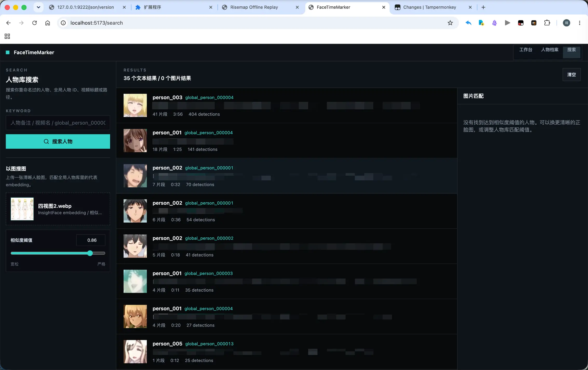

# FaceTimeMarker 用户使用手册

最后更新：2026-07-07

## 适用场景

FaceTimeMarker 适合本地整理影视、动漫或素材视频中的人物出现信息。它不是云服务，也不是完整标注平台，而是一个偏剪辑软件工作流的本地工具：

```text
导入视频 -> 后台识别人脸 -> 生成人物时间轴 -> 人工修正 -> 建人物档案 -> 导出/生成参考素材
```

核心页面：

| 页面 | 地址 | 主要用途 |
| --- | --- | --- |
| 工作台 | `/workspace` | 分析视频、查看播放器、人物时间轴、批量整理 |
| 人物档案 | `/profiles` | 按人物/按作品整理跨视频人物、参考帧和四视图 |
| 搜索 | `/search` | 文本搜索和以图搜图 |

## 启动

安装：

```bash
uv sync --extra vision --extra dev
cd web
pnpm install
cd ..
```

启动后端：

```bash
bash scripts/dev-api.sh
```

启动前端：

```bash
bash scripts/dev-web.sh
```

打开：

```text
http://127.0.0.1:5173/
```

## 工作台



工作台分为三栏：

| 区域 | 用途 |
| --- | --- |
| 左侧素材栏 | 上传视频、本地路径分析、导入 timeline、查看任务列表 |
| 中间工作区 | 视频播放器、红框、人物出现时间轴、批量整理人脸 |
| 右侧检查器 | 作品信息、人物清单、人物命名、隐藏、删除、档案关联 |

### 导入视频

支持三种方式：

1. 拖拽视频到左侧上传区域。
2. 在路径输入框填写本地视频路径。
3. 导入已有 `timeline.json`。

多个本地路径可以用分号分隔：

```text
/Users/me/a.mp4; /Users/me/b.mp4
```

浏览器无法直接读取你的本机绝对路径。拖拽上传时，视频会先保存到 `data/uploads/`，再进入同一条分析管线。

### 分析参数

| 选项 | 什么时候用 |
| --- | --- |
| 使用缓存 | 同一个视频重复打开时加快速度 |
| 重新识别 | 修改了识别配置、想重新跑结果时使用 |
| 预设人数 | 明确知道人物数量时填写；否则保持 Auto |
| 系列/作品 | 批量导入同一作品或同一季视频时填写 |
| 配置文件 | 单个视频需要单独参数时填写 TOML 路径 |
| 硬件策略 | auto / cpu / apple / nvidia / intel |
| CPU 降级 | GPU/CoreML/OpenVINO 初始化失败时自动退回 CPU |

常用配置文件：

```text
configs/profiles/anime-high-recall.toml
configs/profiles/anime-lowres-strict.toml
```

### 后台任务

工作台会显示后台任务列表，包括：

- 分析阶段。
- 当前视频。
- 进度。
- 耗时。
- 分辨率、时长等基础信息。
- 取消按钮。

批量任务默认顺序执行，避免多个长视频同时抢 CPU/GPU/内存。

### 人物时间轴

时间轴按人物轨道展示片段：

- 点片段：播放器跳到片段时间。
- 点人物：高亮该人物轨道。
- 再点同一人物：取消高亮。
- Ctrl + 鼠标滚轮：缩放时间轴。
- Alt + 鼠标拖动：横向平移时间轴。
- 右侧缩放轴：调整整体时间范围。

如果片段显示位置和视频画面差一秒左右，优先检查 `采样帧率`。采样帧越稀，代表帧和真实连续画面之间越容易有视觉偏差。

### 红框

红框用于告诉你当前检测到的是哪张脸：

- 开启逐帧框后，前端优先使用 `track-detections` 中最近采样帧的人脸框。
- 如果离最近检测帧超过配置容忍值，红框会隐藏，避免框滞留。
- 只想截图干净画面时，可以关闭红框。

相关配置在 [configs/reference_export.toml](../configs/reference_export.toml)：

```toml
["逐帧框"]
"播放红框使用逐帧框" = true
"最近帧容忍秒数" = 0.8
```

### 批量整理人脸

用于修正误分裂、误归类、背景误检。

常用操作：

| 操作 | 说明 |
| --- | --- |
| 单击卡片 | 选中/取消 |
| 空白处拖动 | 框选多张 |
| 拖动抓手 | 把选中的轨迹拖到目标人物 |
| 拖到右侧人物清单 | 归类到该人物 |
| 拖到时间轴人物轨道 | 归类到该轨道人物 |
| 删除 | 删除误检轨迹或人物，危险操作会确认 |

推荐规则：

```text
卡片主体负责选择；抓手负责拖动；删除必须确认。
```

## 人物档案



人物档案页用于跨视频整理同一个人物，不只是看单个视频的 `person_001`。

### 左侧浏览模式

| Tab | 用途 |
| --- | --- |
| 按人物 | 以全局人物档案为中心查看作品观测 |
| 按作品 | 以单个视频/作品为中心查看本作品人物 |
| 回收站 | 恢复或彻底删除人物档案 |

左侧可以手动新建空档案。选中同一作品同一人物的参考素材后，也可以“用已选素材新建档案”，这会把本地人物关联到新档案。

### 按作品整理

按作品模式适合先粗分一部作品：

- 每个人一块。
- 上方显示人物 ID、全局人物 ID、片段数、检测框数、候选帧数。
- 下方展示参考帧。
- 右侧人物片段预览可播放该人物出现片段。
- 可以全选某个人的参考帧，再创建新档案或生成四视图。

参考帧有三种显示：

| 模式 | 用途 |
| --- | --- |
| 完整画面 | 看上下文、角色站位、服装 |
| 脸部标记 | 在完整画面上叠加红框，告诉 AI 和用户“是谁” |
| 脸部截图 | 快速比较脸 |

### 按人物整理

按人物模式适合整理一个跨作品人物：

- 看该人物出现过哪些作品。
- 看每个作品下的形象和参考帧。
- 上传或生成四视图资产。
- 合并误创建的档案。
- 重命名人物档案。
- 移入回收站。

四视图资产不是一个人物只能有一张。一个人物在同一作品里可能有多套衣服、多种形象，因此允许多张四视图原图并横向滚动展示。

### 四视图生成



生成四视图前需要：

1. 选择参考素材。
2. 确认参考素材都是同一个人物。
3. 配置 [configs/ai.toml](../configs/ai.toml)。
4. 点击“生成四视图”。

默认提示词目标是生成一张未切分的横向角色设定表：

```text
正面全身 / 侧面全身 / 背面全身 / 45 度全身或半身 / 右侧细节区
```

右侧细节区建议做成两列：

- 第一列：45 度脸部特写，补五官、发型、眼睛和脸型；再加 2~3 个轻微微表情小头像。
- 第二列：服装/发型/配饰细节，补领口、袖口、腰带、纹样、饰品、发梢等设计点。

生成结果会保存为四视图资产，并返回给前端预览。你也可以手动上传已有四视图原图。



### 四视图输出格式

默认配置是 WebP：

```toml
["图像生成"]
"输出格式" = "webp"
"输出压缩" = 85
```

WebP 文件体积更小，适合本地人物档案长期保存。OpenAI GPT Image 官方支持 `png`、`jpeg`、`webp` 三种输出格式；如果你要最大兼容性，可以改成：

```toml
"输出格式" = "png"
```

`"输出压缩"` 主要给 WebP/JPEG 使用。数值越低通常文件越小，但细节损失越明显；PNG 会忽略该参数。部分中转平台可能会忽略输出格式参数，本项目后端会尽量按配置做本地兜底转码。

如果生成失败，先检查：

- `configs/ai.toml` 的接口地址、API Key、模型名。
- 中转平台是否限流或封控。
- 参考图是否太多、太大或格式不支持。
- 后端日志中 LiteLLM 返回的错误。

## 搜索



搜索页支持两类搜索：

### 文本搜索

匹配：

- 人物标签。
- 全局人物 ID。
- 视频标题。
- 原始文件名。
- 路径。

### 以图搜图

上传一张人脸图后，系统会提取 embedding 并和人物库匹配。

阈值建议：

| 现象 | 调整 |
| --- | --- |
| 返回一堆不相关人物 | 提高阈值 |
| 找不到相似人物 | 降低阈值 |
| 上传图没有显示 | 先确认文件是 JPG/PNG/WebP，刷新页面后重试 |

以图搜图依赖人物库里已有代表脸和 embedding。如果视频还没分析或人物库为空，结果会很差。

## 识别不准时怎么调

主要配置在 [configs/recognition.toml](../configs/recognition.toml)。

| 问题 | 优先调 |
| --- | --- |
| 主角漏识别、小脸漏识别 | 提高 `采样帧率`，降低 `最小人脸尺寸`，降低 `检测置信度阈值` |
| 红框几秒才更新一次 | 提高 `采样帧率`，例如 2.0 改 5.0 |
| 背景墙、纹理、局部眼睛被识别人脸 | 提高 `检测置信度阈值`，提高 `最小人脸尺寸`，提高 `最小连续帧数` |
| 同一个人被分成多个人 | 降低 `最小簇大小` 或 `最小样本数`，适当降低 `外观相似阈值` |
| 不同人被合成一个人 | 提高 `最小匹配阈值`，提高 `检测置信度阈值`，缩短 `丢失轨迹缓冲帧数` |
| 动作大、转头后断轨 | 提高 `采样帧率`，提高 `丢失轨迹缓冲帧数` |

推荐先试：

```text
configs/profiles/anime-lowres-strict.toml
```

误检少了但漏主角，再试：

```text
configs/profiles/anime-high-recall.toml
```

## 常见问题

### 已经分析过，改了参数还需要重新跑吗？

需要。识别参数影响抽帧、检测、跟踪、聚类结果。改参数后请开启“重新识别”或 CLI 加 `--no-cache`。

### 为什么人物头像像是片段前一秒？

头像通常来自代表检测帧。视频播放器连续播放，而识别只在采样帧上做检测；采样率低时会产生视觉错位感。提高 `采样帧率` 可以缓解。

### 三个人同屏会识别出来吗？

如果三张脸都被检测到，会分别进入检测、跟踪和聚类流程。漏掉通常是小脸、侧脸、遮挡、阈值过高或动漫脸模型不稳定导致。

### 我想要的人一直识别不出来怎么办？

先调高召回：

1. `采样帧率 = 5.0` 或 `8.0`。
2. `最小人脸尺寸 = 24` 或 `16`。
3. `检测置信度阈值 = 0.45`。
4. 使用 `anime-high-recall.toml`。

如果仍然检测不到，说明当前人脸模型可能不适合该画风，需要后续接入专门动漫人脸模型。

### 要不要复制源文件？

默认不复制。`configs/outputs.toml` 中：

```toml
["源媒体"]
"拷贝源文件" = false
```

这更接近剪辑软件：源文件还在原路径就直接链接，丢失后需要重新链接。浏览器上传除外，因为浏览器拿不到你的本机真实路径，只能把上传文件保存到 `data/uploads/`。

## 维护建议

- 每次新增前端功能，同步更新本手册对应页面。
- 每次新增 API，同步更新 [技术架构文档](README-技术架构.md)。
- 每次新增配置项，同步更新配置文件注释和本手册“识别不准时怎么调”。
